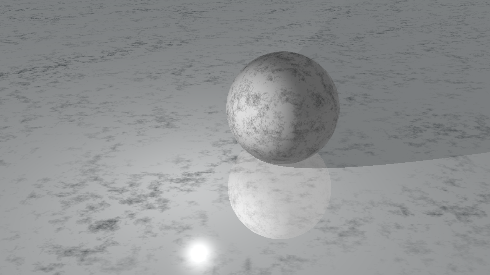
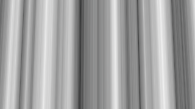
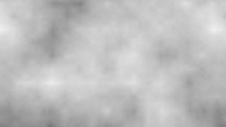
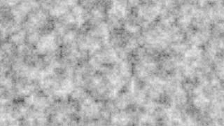
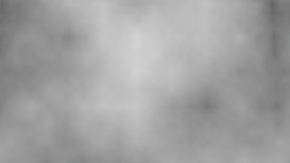
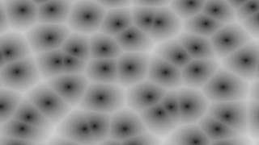
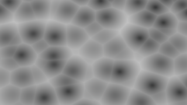

# Extension: 3D noise textures



### Author: Jaroslav Nejedlý

### Category: Texture

### Namespace: JaroslavNejedly, JaroslavNejedly.Extensions

### Class Name: 
 #### PerlinTexture
 #### VoronoiTexture

### ITimeDependent: No

### Source file: Texture3D.cs

3D noise textures that are very common in different graphical applications. Both Voronoi and Perlin textures are tileable and they tile with period of 1.0.

### Perlin noise

Perlin noise is a noise that is random, yet it is smooth. The sampling of perlin noise is usually done in so called octaves. The higher the octave the less smooth the noise is. The highes octave is just fully random. The lowest octave is single color. The amplitude of higher octaves is lower, which results in smoother look of the texture. The fall off of the amplitude is controlled via the `bias` variable in the constructor. The amplitude is divided by bias for higher octaves.

The constructor takes 4 parameters. The ranom seed, resolution, base amplitude and bias. The base amplitude controls the intensity of the lowest octave that is being used. Bias controls the falloff of the amplitude with higher octaves. Resolution the resolution of highest octave. **Beware!** It is 3D texture, so the resolution is actually cubed, each texel is 8 bytes (e.g. for resolution 128 the size is 16MB and for 256 the size is 134MB). Please use only power of two resolutions. The random seed controls the "version" of the texture, if you use different seed, you get different texture. All 4 parameters have some default values, so you don't have to fill them all.

Perlin texture provides 3 different modes: 1D, 2D, 3D. To Get the value you like use these functions: 
 - `double Perlin1D(double x, int minOctave, int maxOctave)`
 - `double Perlin2D(double x, double y, int minOctave, int maxOctave)`
 - `double Perlin3D(double x, double y, double z, int minOctave, int maxOctave)`

### Voronoi texture

Voronoi texture looks like cells.

The constructor takes 2 parameters. The first is number of cells, the second is random seed. The actual number of cells is cubed, because the texture is 3D. The size of a single cell is 24 bytes (so for the resolution of 16, the size of texture is 100kB). The ranodm seed is used to create  different variants of the voronoi texture.

The Voronoi texture has following sampling modes:

- `double GetDistance2D(Vector2d)`
- `double GetDistance3D(Vector3d)`

### Examples &amp; sample scripts:

To use the textures you simply create them using the constructor. To assign the texture to the scene object, use standard `someObj.SetAttribute(PropertyName.TEXTURE, YOUR_TEXTURE);`. For advanced effects you might want to assign custom mapping to the texture. To do so simply assign lambda function to `Mapping` property of the texture. Here is full example:

```C#
PelrinTexture myTexture = new PerlinTexture(/*seed*/0,/*resolution*/128,/*amplitude*/1.0, /*bias*/1.5);

Sphere s = new Sphere();
s.SetAttribute(PropertyName.TEXTURE, myTexture);

//Mapping is Func<Intersection, long>
myTexture.Mapping = i => {
    //Smaple you texture using Perlin2D function. Note: you can sample other textures as well and combine the results.
    double perlinColor = myTexture.Perlin2D(i.TextureCoord.X / 4, i.TextureCoord.Y / 4, /*starting octave*/2, /*ending octave*/6);

    //Assign the perlin noise as a greyscale value.
    i.SurfaceColor = new double[] {perlinColor, perlinColor, perlinColor};

    //Set the texture applied flag.
    i.textureApplied = true;
    //return hash for adaptive multisampling
    return 1L;
};
```

For more comlex exaple see: [DemoScene.cs](DemoScene.cs).

#### Sample scene script: [DemoScene.cs](DemoScene.cs)

### Issues and things to be aware of:

---

## Color Extensions

The source file also contains useful extension functions that work on `IEnumerable<double>`. So you can use them on any type that derives from this interface. The synax is similar to LINQ fluent syntax.

Sample code looks like this:
```C#
double[] color = new double[3];
double[] modifiedColor = color.BrightnessContrast(0.7, 1.4).Invert().Mul(1.3).Gamma(2.2).Finalize();
```

The available functions are:
 - Add  
   - adds other color (`IEnumerable<double>`) or scalar value
 - Mul  
   - multiplies by other color or scalar value
 - MulSaturated
   - multiplies by scalar value that is saturated (clamped between 0.0 and 1.0)
 - Gamma
   - applies gamma (exponent)
 - Mix
   - mixes two colors together
 - BrightnessContrast
   - Applies brightness/contrast operator (see [here](https://docs.nvidia.com/deeplearning/dali/user-guide/docs/examples/image_processing/brightness_contrast_example.html))
 - Invert
   - Creates negative of the color
 - FillFlat
   - Fills each band of a color with provided value
 - Finalize
   - Converts `IEnumerable<double>` into array `double[]` and saturates each band (clapms it between 0.0 and 1.0)
   - If you don't want the stauration, call the LINQ function `ToArray()` (you will have to include System.LINQ namespace)

Additionally there are functions that do not operate on `IEnumerable<double>`:
 - AsColor
   - `double` extesion that converts the value into `IEnumerable<double>` with only one element (itself), useful if you want to apply any of the color operations described above
 - AsFactor
   - Converts `IEnumerable<double>` back to `double`. Used after applying color operators after AsColor function.
 - ColorRamp
   - UNTESTED. This should interpolate between colors (passed as second argument) based on parameter "factor".
 - ColorFromHSV
   - UNTESTED. This should create `double[]` containing rgb values corresponding to hsv color.

## Images

##### 1D Perlin Low Octaves


##### 1D Perlin High Octaves



##### 2D Perlin Low Octaves



##### 2D Perlin High Octaves



##### 3D Perlin (single slice)



##### 2D Voronoi



##### 3D Voronoi



Notice how the cells from "above" influences the texture in comparison with the 2D version.

##### By using clever mapping we can simulate different materials.


