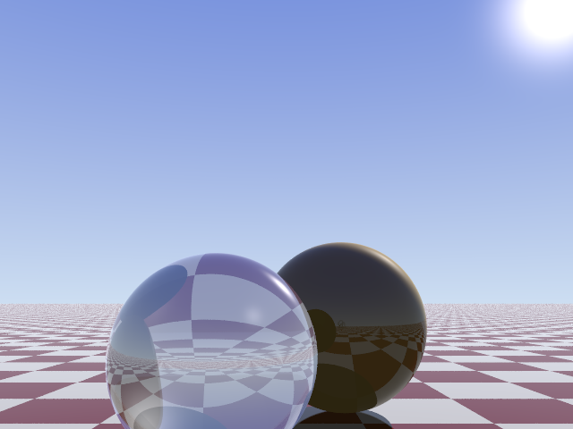
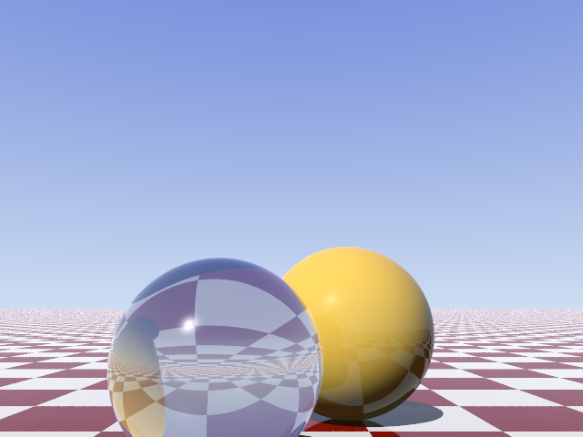
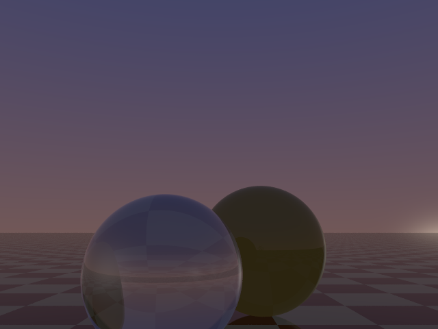
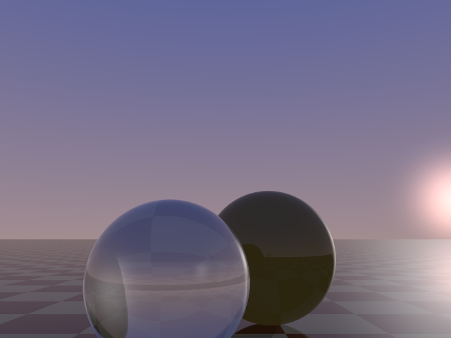
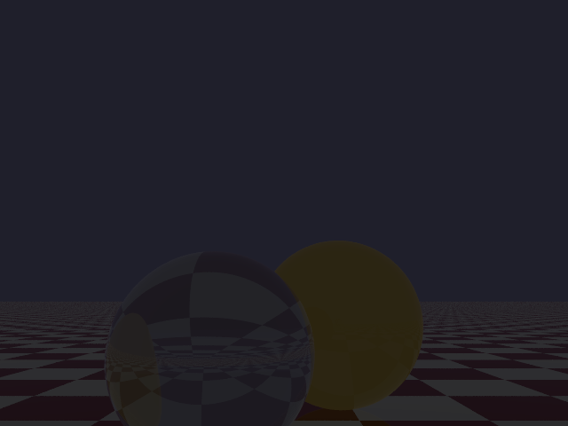
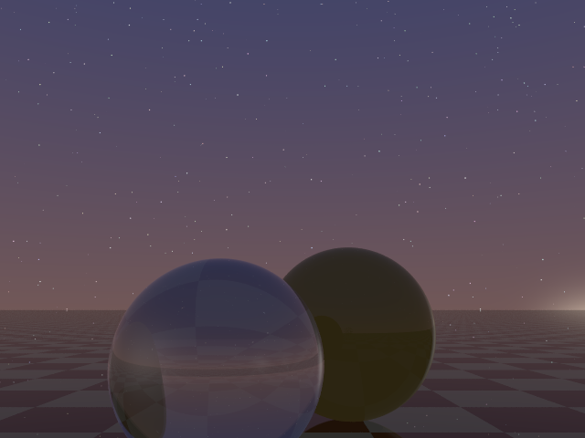
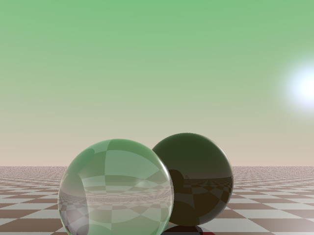

# Extension: Advanced background



### Author: Jaroslav Nejedlý

### Category: Background

### Namespace: JaroslavNejedly

### Class Name: AdvancedBackground : IBackground

### ITimeDependent: Not yet... 😉

### Source file: AdvancedBackground.cs

This extension provides you with a nice looking sky (without clouds). The advanced background also provides you with Sun light source. The `SunLight : ILightSource` is just simple implementation of directional light. I tried to make all paramteres customizable. And I also provided default values that IMHO look good (or at least I tried to make them look good). The parameters are stored in struct `AdvancedBackgroundPreset`.

The list of customizable parameters:
 * OutScatterColor - This is the color of the sky directly above. Type: `double[]`
 * GroundColor - This is color directly below. In "normal" scenes this shouldn't be visible. Type: `double[]`
 * HorizonColor - This is the color on the horizon, but only when the sun is high enough. If the sun is low above horizon, this color blends into InScatterColor. Type: `double[]`
 * InScatterColor - This is the color of sunrise/sunset. Type: `double[]`
 * SunTint - This modifies the color of the sun that is show on the sky (it does not interact with the underlaying light source). Type: `double[]`
 * SunSmallness - This modifies the size of the sun on the sky. The higher the value, the smaller the sun will be. Type: `double`
 * SunIntensity - This sets the intensity of the sun and it also contros the underlaying light source. Type: `double[]`
 * SunDirection - This controls the position of the sun on the sky. Type: `Vector3d`
 * NightColor - This is the color of the sky when the sun is down (in the night).  Type: `double[]`
 * SunIntensityMultiplier - This modifies the intensity of the sun light. Tou might want to lower the value when the sun is down. Type: `double`
 * NightBackground - *Optional* - This is the reference to `IBackground` object that is used to render the sky during night. You can use this to add [star background.](../JosefPelikan-StarBackground/README.md) Type: `IBackground`

### Examples &amp; sample scripts:

To use the advanced background simply create it: `var backround = new AdvancedBackground();`. If you don't provide any parameters into the constructor, the advanced background will use the default settings. But don't worry you can change them later by modifying: `background.CurrentPreset`. Then don't forget to add it to the scene: `scene.Background = background;`. Then you can add the sun into scene light source collection: `scene.Sources.Add(background.Sun);`, but this step is optional. If you don't want to add the sun, you might want to disable the sun rendering: `background.CurrentPreset.SunTint = new double[] {0, 0, 0};`.

Basic example:

```
//Don't forget to use correct namespaces
using JaroslavNejedly;

/*
 * SOME CODE WHERE YOU SET UP YOUR SCENE
 */

//Let's use the default preset as a starting point. You can change the parameters later.
var background = new AdvancedBackground();
//Add the backround into the scene.
scene.Background = background;
//Add the sun into the scene
scene.Sources.Add(background.Sun);

//You can change any parameters by modifying CurrentPreset property.
//Let's put the sun just above the horizon ¯\_(ツ)_/¯
background.CurrentPreset.SunDirection = new Vector3d(0, 0.1, 1.0);
```
See [DemoScene.cs](DemoScene.cs) for exact example.

If you wish to incorporate [the star background](../JosefPelikan-StarBackground/README.md), you can do so by modifying `background.CurrentPreset.NightBackground`:
```
using JosefPelikan;
/*
 * SAME CODE AS IN EXAMPLE ABOVE
 */

background.CurrentPreset.NightBackground = new StarBackground(advBackground.CurrentPreset.NightColor);
```
Uncomment last line in [DemoScene.cs](DemoScene.cs) to see the effect.

For custom preset example you can look at [DemoSceneCustomPreset.cs.](DemoSceneCustomPreset.cs)

If you are using different up vector in your scene you have to set it correctly in the advanced background. The following line changes the default up vector  `background = new AdvancedBackground(Vector3d.UnitZ);` 

#### Sample scene script: DemoScene.cs

#### Sample scene script with custom preset: DemoSceneCustomPreset.cs

## Issues and things to be aware of:

The advanced background adds quite a lot of light into the scene. Be aware of that. This might cause some lighting issues. The amount of light provided by the advanced background is substaintial, even if you do not add provided sun light source into the scene.

Also please beware what is the up direction in your scene. Default value is (0, 1, 0).

## Imges &amp; videos

#### Sky background



#### With the sun!


#### Redish tones of sunrise



#### Morning



#### Night



#### Can incorporate [star background](../JosefPelikan-StarBackground/README.md)



#### Custom presets


